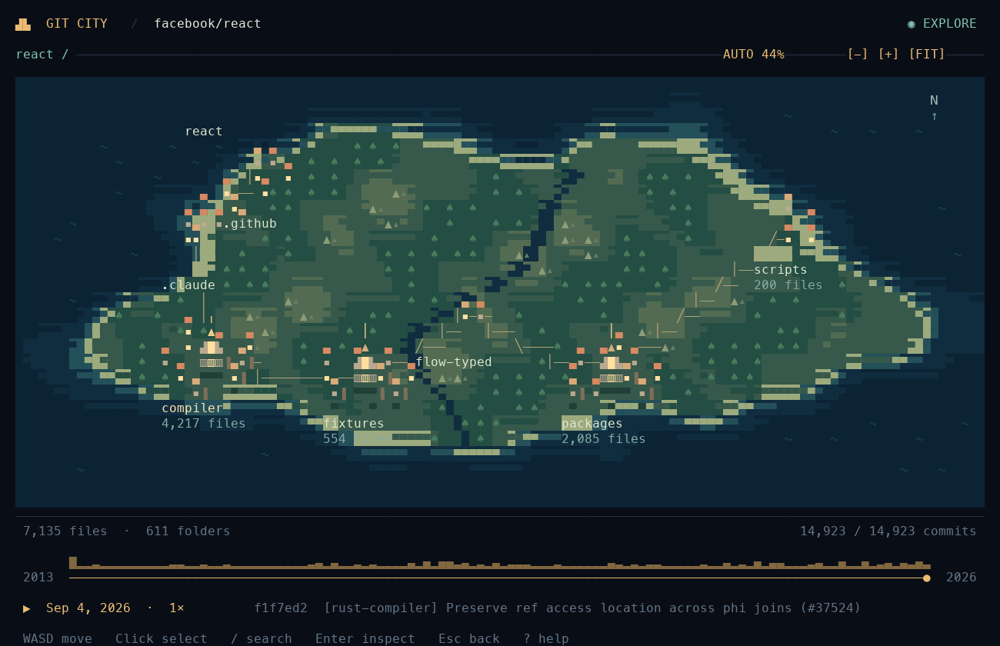
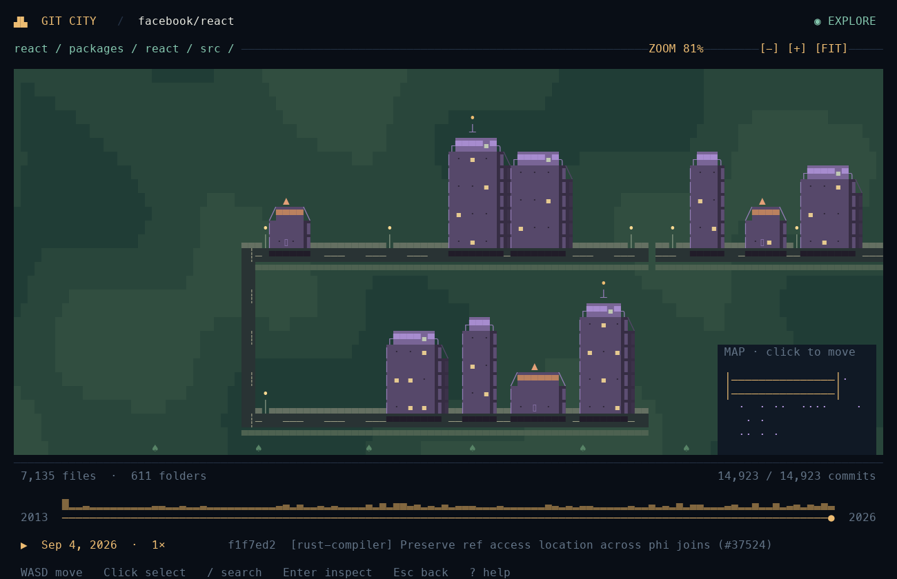

# Explore your codebase as a living city.

```bash
gitcity facebook/react
```

Files become houses and towers. Folders form settlements across a landscape of coastlines, rivers, forests, and hills. Git history becomes time.

Git City is a **TypeScript + OpenTUI terminal application**. Give it any public GitHub repository as `owner/repo`; it downloads the repository automatically, without a GitHub token or a manual checkout.





[Watch the history replay](docs/images/history.gif).

## Install once

You need Git and either **Node.js 26.4+** or **Node.js 20+ with Bun installed on PATH**. The launcher enables OpenTUI's native FFI when using Node. A true-color terminal of at least 100×35 is recommended; a larger window shows more detail.

Clone this repository and install:

```bash
git clone https://github.com/unluckyjet/GitCity.git
cd GitCity
npm ci
npm run build
npm install -g .
```

Then use the command from any directory:

```bash
gitcity facebook/react
gitcity expressjs/express
gitcity vercel/next.js --history
gitcity antirez/redis --speed 2
```

To build a portable npm package from this checkout:

```bash
npm pack
npm install -g ./gitcity-0.4.0.tgz
```

This project has not been published to the npm registry. Install from this repository or a locally built tarball.

Each repository has a stable landscape identity: coast, highland, or river terrain with its own coastline, river course, palette, and building materials. GitHub URL and `owner/repo` forms produce the same world; history playback keeps it fixed.

## Watch the town become a city

Press **Space** at the latest commit to replay from the beginning, or launch with `--history` to start at the first commit.

- Small files draw as houses with pitched roofs; larger files become towers. Documentation, tooling, UI, tests, and configuration files use distinct facades and roof silhouettes. Related folders share repository-specific building materials; language remains visible in accents and inspection.
- New streets are laid out near the older city, in order of first appearance.
- Existing buildings keep their coordinates as files appear, grow, or disappear.
- Replay opens close to the first street, then the camera continuously fits the **currently occupied city**, pulling back as it grows. Future files do not determine the early camera frame.
- Scroll the **mouse wheel** to zoom toward the pointer, or use **+ / −** to zoom around the viewport center.
- Large repositories become a landscape with coastlines, forests, mountain ranges, a river, bridges, and settlements connected by roads. Larger settlements have denser buildings and a prominent central landmark. Labels use real repository names; direct files use the repository name at the top level and `./` in nested views. Click a region to enter it. Click breadcrumbs or press Esc to return. Only occupied settlements appear. Their positions stay tied to the complete folder history. Hover reveals full names and file counts.
- Inside large flat folders, a single terminal cell can contain several files. **Click that block to zoom into it**, then click an individual building for a compact preview. Press Enter for the inspector. No file identities are discarded by the overview.
- New buildings rise, edits illuminate windows, and removed buildings fade. A change caption summarizes differences between displayed commits.
- Press **/** to search current files and folders; choose a result to fly there. Close views have shaded building facades, warm windows, planned avenues and lanes, central squares, courtyards, gardens, sidewalks, and streetlights. Every file entrance faces its street. Coastal settlements have docks. A clickable minimap appears while exploring without a selection or inspector.
- Moving, zooming, selecting, or drilling into a block pauses playback. Manual movement or zoom disables automatic framing. **R** or the **FIT** button restores it.

The first frame is the actual first committed tree. It is initially viewed close to the first street; the building count still includes files elsewhere in that tree. The visualization does not invent a smaller history.

## Controls

| Control                          | Action                                                                |
| -------------------------------- | --------------------------------------------------------------------- |
| WASD / arrows                    | Move the camera; arrows scrub when History mode is active             |
| Mouse wheel                      | Zoom toward the pointer; pauses playback                              |
| + / −                            | Zoom in / out                                                         |
| Click a dense block              | Zoom into its real files                                              |
| Click a region / breadcrumb      | Enter a folder / navigate to an ancestor                              |
| Click a building                 | Show a compact file preview                                           |
| Enter                            | Expand the inspector                                                  |
| /                                | Search files and folders at this commit                               |
| V / Shift+D / G                  | Source preview / selected-commit diff / open exact revision on GitHub |
| PgUp / PgDn or wheel over source | Scroll source or diff                                                 |
| Click minimap                    | Recenter the active map                                               |
| [ / ]                            | Select and frame the previous / next building                         |
| Tab                              | Toggle the inspector                                                  |
| M / N                            | Freeze ambient animation / cycle automatic, day, and night lighting   |
| Space                            | Play / pause; restart from the beginning at HEAD                      |
| T                                | Toggle Explore / History arrow controls                               |
| Left / right in History mode     | Previous / next exact commit                                          |
| , / .                            | Slower / faster playback                                              |
| Home / End                       | First / latest commit                                                 |
| R / FIT button                   | Fit the current territory and restore automatic framing               |
| Esc                              | Close overlay or selection, then return to the previous territory     |
| ?                                | Help                                                                  |
| Q / Ctrl+C                       | Quit                                                                  |

The inspector shows the file path, detected language, size, exact text line count, historical commit count, contributor count, and last-change date. Binary files display `binary` for lines. Source and diff previews read committed Git objects, cap output at 64 KiB / 600 lines, and never execute repository code. Diffs compare the selected commit to its first parent; unchanged files show no diff. The GitHub action opens your browser only when requested and requires a GitHub remote.

The landscape has subtle road traffic, river boats, workshop smoke, moving cloud shadows, and a two-minute day/night cycle. Press **M** to freeze ambient animation or set `GITCITY_REDUCED_MOTION=1` before launching. Press **N** to keep day or night lighting. Ambient time is independent of commit playback.

## Repository inputs and options

```bash
gitcity facebook/react --history --speed 2
gitcity expressjs/express --exclude '*.lock' --exclude 'docs/**'
gitcity https://github.com/facebook/react
gitcity github.com/facebook/react
gitcity ./my-local-repo
gitcity /absolute/path/to/repo
gitcity facebook/react --snapshot
gitcity facebook/react --history --json > first-commit.json
```

Bare `owner/repo` **always means GitHub**, even if a similarly named directory exists locally. Prefix a local relative path with `./` to disambiguate. Omitting the repository still uses the current directory.

| Option             | Meaning                                             |
| ------------------ | --------------------------------------------------- |
| --history          | Start at the first available commit                 |
| --speed number     | Playback multiplier, 0.25–32; default 1             |
| --exclude glob     | Exclude paths throughout history; repeat as needed  |
| --snapshot         | Print a headless summary, then exit                 |
| --json             | Print the selected commit and file metadata as JSON |
| --help / --version | Usage or package version                            |

Headless modes default to HEAD unless combined with `--history`. Quote glob patterns to prevent shell expansion. Headless commands run on Node.js 20+ without native FFI.

## What is downloaded and analyzed

Public GitHub inputs create a temporary bare clone with complete default-branch history. No GitHub account, API key, hosted backend, or database is required. Git City removes its temporary clone on normal exit. The terminal application runs on your machine; the repository source comes from GitHub.

History follows the checked-out branch's **first-parent ancestry**, oldest to newest. A merge is a single frame compared with its first parent. File commit counts and author counts use that same chain. Renames are represented as deletion at the old path and creation at the new path.

Playback samples long histories into approximately 30 seconds at 1×, skipping intermediate frames when tree reads are slow; manual stepping always selects the exact adjacent commit. Small histories take fewer frames. Clone time is additional.

Roads are decorative navigation connections between folders, not an import/dependency graph. The terrain is a procedural visual metaphor, not real geography.

Snapshots read Git objects directly and do not change a local working tree. Uncommitted files, submodule contents, and Git LFS payloads are excluded. A shallow local clone only provides its available history.

Language detection uses filename and extension heuristics. Exclusions cover dependency/build/vendor/generated directories and common generated suffixes, not a complete GitHub Linguist ruleset. Raw Git change records avoid expensive unused line-diff calculations. Exact text line counts load when a file is inspected.

## Development and demo

```bash
npm run typecheck
npm test
npm run build
npm run dev -- facebook/react --history
```

Tests require Node.js 26.4+ for the native OpenTUI renderer.

To create a small fictional repository with 120 commits, 45 final files, additions, growth, renames, and deletions:

```bash
node scripts/create-demo.ts /tmp/gitcity-demo
gitcity /tmp/gitcity-demo --history
```

The generator refuses to overwrite a nonempty destination.

```text
src/repository.ts   Public/local Git loading and historical snapshots
src/city.ts         Stable neighborhoods placed by file birth order
src/atlas.ts        Stable folder territories and ranked search
src/geography.ts    Terrain, settlement placement, roads, and hit detection
src/landscape.ts    Native terrain, settlements, and neighborhood painting
src/controller.ts  Playback, camera fitting, anchored zoom, and selection
src/scene.ts       Houses, towers, overview cells, inspector, and timeline
src/app.ts         Native OpenTUI rendering and keyboard/mouse handling
src/cli.ts         CLI arguments and headless output
bin/gitcity.mjs    Installed gitcity executable and runtime selection
```

`npm pack` builds the compiled application and creates an installable tarball. Publishing remains a separate step. See [validation notes](VALIDATION.md) for tested behavior and limitations.

MIT licensed.

Deleted files leave selectable foundations. Click one to inspect its last contents (`V`), deletion diff (`Shift+D`), or surviving GitHub revision (`G`). Press `U` to hide or show ruins.

Press `P` for import routes. Select a file and click an incoming/outgoing link to travel to it. Cyan routes import another file; purple routes lead from callers. Analysis parses JS/TS literal imports, exports, require, and dynamic import, resolving relative paths, index modules, tsconfig aliases, and workspace package main/module paths. It does not execute repository code. External/dynamic or unsupported resolution stays unresolved. Files above 1 MiB and source beyond a 48 MiB analysis budget are skipped and counted.

Press `O` to cycle churn (last 100 commits), size, resolved incoming imports, contributor ownership, and normal materials. Legends explain the colors and selecting a file shows its value. Ownership means the author name with the most file touches in the selected first-parent history, not line-level blame. At a distance, each settlement highlights its highest-value file.

Press `J` for guided walks: entry candidates (`1`), follow imports (`2`), or busiest files (`3`). Tours advance every eight seconds. Use `[` / `]` for stops, `Space` to pause, and `Esc` to finish. Import journeys follow static source connections; they do not claim to trace runtime requests.
